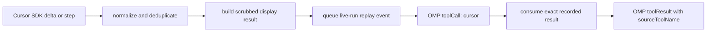

# Cursor native tool replay

Cursor SDK host tools execute inside Cursor's local agent. `omp-cursor-sdk` mirrors their completed activity into OMP without executing the work a second time.

User-facing namespace overview: [Cursor tool surfaces in OMP](./cursor-tool-surfaces.md).

## OMP 18 replay boundary

OMP exposes builtin tool metadata but not executable builtin definitions that an extension can safely wrap. The extension therefore:

1. registers one replay-only tool named `cursor`;
2. leaves OMP's `read`, `bash`, `edit`, `write`, `grep`, `find`, and `ls` untouched;
3. maps replayable Cursor SDK activity to `toolCall.name === "cursor"`;
4. retains the original display identity in `toolResult.details.sourceToolName`;
5. returns only a previously recorded result for the exact replay ID.

An unrecognized replay ID fails closed:

```text
No recorded Cursor activity result was available. This replay-only tool does not execute work directly.
```

## Replay lifecycle



The first provider turn can stop with `toolUse` while the SDK run remains active. OMP executes the replay-only `cursor` call, appends its result, then the next provider turn drains the same live run. Thinking and text emitted after the SDK tool remain ordered and are not duplicated.

Queued activity that becomes inactive before replay is emitted as a bounded thinking trace. Its original source identity is retained for that trace.

## Display variants

The neutral tool renders recorded result details by variant:

| Variant | Purpose |
| --- | --- |
| `activity` | Read, search, shell, tasks, plans, web, MCP, and generic visible activity |
| `nativeEdit` | Structured edit diff |
| `nativeWrite` | Structured write/file preview |
| `generateImage` | Bounded image metadata and optional local image preview |
| `genericFallback` | Unknown/future SDK result with bounded scrubbed text |

Core host activity is adapted to `activity` when it enters the neutral OMP tool. Existing edit/write structured variants are preserved.

Cursor SDK tool names and result payloads are external contracts and may change. The extension normalizes only shapes verified by the installed SDK, captured fixtures, or focused contract tests. Unknown completed tools use the bounded fallback; missing SDK events are not fabricated.

## Source identity

SDK replay:

```json
{
  "role": "assistant",
  "content": [
    {
      "type": "toolCall",
      "name": "cursor",
      "id": "cursor-replay-..."
    }
  ]
}
```

```json
{
  "role": "toolResult",
  "toolName": "cursor",
  "details": {
    "variant": "activity",
    "sourceToolName": "read"
  }
}
```

Bridge calls are different. A Cursor call to `pi__read` becomes the real OMP `read` call/result and does not use the replay-only tool.

## Incomplete and failed activity

- A completed replay result marked as error throws a scrubbed error so OMP records an error result.
- A started SDK tool without completion produces bounded incomplete activity or a trace.
- Abort-discarded activity is not presented as completed.
- Duplicate delta/step/transcript observations are suppressed by the turn ledger.
- Shell output deltas are merged only when attribution to one shell call is unambiguous.

## Active tool routing

Routing uses the `context.tools` snapshot supplied to the provider turn:

- active neutral `cursor` tool plus a live run: queue replay;
- inactive neutral tool: emit inactive trace;
- no live run or replay disabled: emit transcript trace.

The extension separately synchronizes the registered neutral tool on Cursor model lifecycle events. It never activates it for OMP's builtin `cursor` provider.

## Controls

```bash
# Disable replay display and registration.
PI_CURSOR_NATIVE_TOOL_DISPLAY=0 \
omp --model cursor-sdk/grok-4.6

# Registration-only opt-out.
PI_CURSOR_REGISTER_NATIVE_TOOLS=0 \
omp --model cursor-sdk/grok-4.6

# Keep replay active but disable the OMP bridge.
PI_CURSOR_PI_TOOL_BRIDGE=0 \
omp --model cursor-sdk/grok-4.6
```

Print mode does not register interactive replay tools. TUI, JSON, and RPC modes can request replay; actual routing still depends on the active tool snapshot and live-run state.

## Limits and safety

- Replay data is scrubbed before entering OMP history.
- API keys, bearer values, cookies, auth headers, and tokenized loopback URLs must not appear in replay or errors.
- Large text, lists, diffs, and previews are bounded.
- Replay never reads a file merely to reconstruct an unavailable SDK result except for explicitly bounded visual preview helpers.
- Debug event capture is raw local evidence and may contain sensitive prompts or tool payloads.

## Verification

Focused behavior:

```bash
bun test --isolate \
  test/index-native-tools.test.ts \
  test/cursor-native-replay-routing.test.ts \
  test/cursor-provider-replay-live-run.test.ts \
  test/cursor-provider-replay-tool-display.test.ts \
  test/cursor-provider-replay-shell.test.ts
```

Visual behavior:

```bash
npm run smoke:visual -- \
  --model cursor-sdk/grok-4.6 \
  --label native-replay \
  --prompt 'Read package.json, then report the package name.'
```

Release behavior remains gated by `npm run smoke:platform:all`.
